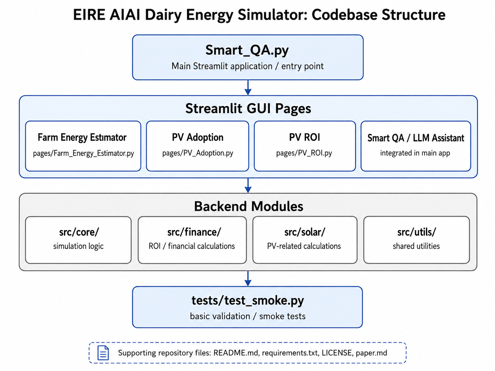
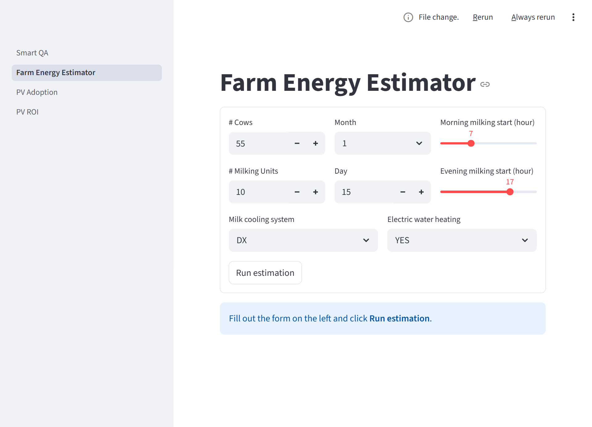

# Summary

Dairy farms increasingly need to understand their electricity demand and assess whether on-farm photovoltaic (PV) generation is financially worthwhile. These questions are difficult to answer with a single static calculation because farm electricity use depends on herd size, milking practice, cooling configuration, water-heating choices, seasonality, and changing electricity prices [@buckley2024farm; @breen2020photovoltaic].

EIRE AIAI Dairy Energy Simulator is a Python and Streamlit application for exploring dairy-farm electricity demand, PV return-on-investment (ROI), and PV adoption scenarios. The software brings together several research workflows in a multi-page graphical interface so that users can run common analyses without editing notebooks or source code. It is intended for researchers, agricultural-energy advisors, and users who need to compare assumptions about farm energy use, PV costs, subsidies, and adoption behaviour.

The package includes backend modules for farm-energy estimation, PV financial calculations, and adoption scenario simulation. It also includes an optional local LLM-assisted interface for energy-related question answering and interpretation support.

# Statement of need

Dairy-farm electricity use depends on farm structure, herd size, milking practice, cooling configuration, water-heating choices, seasonality, and electricity-price assumptions. These factors make it difficult to assess baseline electricity demand or the likely value of photovoltaic (PV) investment using a single static calculation [@buckley2024farm; @breen2020photovoltaic].

Existing research has developed methods and software for farm-energy analysis, PV planning, and agricultural decision support. The Farm Electricity System Simulator (FESS), for example, demonstrates the value of domain-specific dairy-farm electricity simulation [@buckley2024farm]. Other work has analysed PV sizing and investment decisions for dairy farms [@breen2020photovoltaic], and decision-support tools have been proposed for ranking fossil-energy-free technologies at farm level [@kyriakarakos2023design]. However, review work has noted that many farm-level decision-support implementations remain fragmented across spreadsheets, scripts, and bespoke prototypes [@arulnathan2020farm].

For the Irish dairy-farm context, previous research has developed agent-based workflows for modelling electricity consumption and simulating solar PV adoption [@khaleghy2023modelling; @faiud2024agent]. These workflows provide the modelling basis for parts of EIRE AIAI Dairy Energy Simulator, but they were not originally packaged as a single interactive tool for users who want to compare scenarios without editing notebooks or source code.

EIRE AIAI Dairy Energy Simulator addresses this need by combining farm-energy estimation, PV ROI analysis, and PV adoption modelling in one Streamlit application. The software is intended for researchers, agricultural-energy advisors, and other users who need to explore dairy-farm energy and PV assumptions in a reusable and interactive environment.

# Software design

## System architecture

The software is implemented as a modular Python application with a separation between modeling logic and user-interface components. A Streamlit-based graphical user interface (GUI) provides page-level access to the main workflows, while backend modules encapsulate simulation, photovoltaic, and financial calculations. This separation supports both interactive use and future reuse of the underlying computational components outside the GUI.

{ width=90% }

The design was informed by pre-existing notebook-based research code developed across multiple work packages [@khaleghy2026agent; @faiud2024agent]. In contrast to those exploratory implementations, the software reorganizes the relevant logic into callable modules with consistent parameter handling and a unified workflow. 

## Energy and simulation models

The farm-energy estimation component represents electricity demand at the farm level using a modular equipment-oriented structure. The model combines user-configurable farm descriptors, such as herd size, number of milking units, date, milking schedule, milk-cooling configuration, and water-heating choice, with component-level demand calculations to estimate daily electricity consumption, hourly load shape, and equipment-level contributions. Seasonal effects are represented through month-dependent inputs and interpolated daily behavior, allowing the tool to express changing demand patterns across the production year.

This component is designed to support practical scenario exploration rather than high-complexity physical simulation. The modeling strategy prioritizes interpretable inputs and outputs that are meaningful to farm-level decision support, while preserving a structure that remains close to the underlying research logic from which the implementation was derived.

## PV adoption and financial modeling

The software includes two complementary photovoltaic analysis layers: farm-scale ROI analysis and scenario-based PV adoption modeling. The ROI component exposes notebook-aligned economic calculations under selected scenarios and years, allowing users to inspect quantities such as annual savings, annual maintenance, discounted savings, subsidy, and economic utility. The adoption component supports scenario analysis over multiple years by combining assumptions on electricity prices, PV costs, subsidy conditions, and prior adoption levels to estimate uptake trajectories across a farm population.

In the integrated software package, these capabilities are exposed through parameterized backend functions that consolidate functionality previously distributed across notebook-based research workflows. The GUI exposes the main scenario controls used in the current application, including group scenario selection, total number of farms, initial adopters, random seed, scenario year, and optional ROI overrides. Scenario-level assumptions such as electricity prices, PV costs, subsidy conditions, discount rate, and simulation horizon are defined by the selected scenario and displayed to the user where relevant.

## Interactive GUI

A central design goal of the software is accessibility for users who are not expected to work directly with notebooks or source code. The graphical interface is therefore organized as a multi-page application in which each page corresponds to a distinct analytical workflow: farm-energy estimation, PV adoption analysis, PV ROI analysis, and optional LLM-assisted question answering.

{ width=90% }

The interface combines input forms, calculated indicators, plots, and scenario tables.

# Example usage

A typical workflow involves:

1. Estimating a farm’s baseline daily electricity demand using the Farm Energy Estimator, with inputs such as herd size, number of milking units, date, milking schedule, milk-cooling system, and electric water-heating option.
2. Reviewing the estimated outputs, including total daily energy consumption, peak demand, peak hour, hourly load curve, and equipment-level energy breakdown.
3. Exploring PV adoption scenarios by selecting a group scenario and varying the total number of farms, initial adopters, and random seed. The selected scenario defines the simulation years and underlying economic assumptions, including electricity prices, PV costs, subsidy conditions, and discount rate.
4. Evaluating farm-scale PV investment with the PV ROI Calculator by selecting a scenario and year, and optionally overriding assumptions such as annual electricity use, annual solar generation, electricity price, PV cost, subsidy rate, discount rate, and system lifespan.
5. Inspecting the resulting PV metrics, including annual savings, annual maintenance, discounted savings, subsidy, PV cost, and economic utility.
6. Where needed, using the local LLM assistant to ask energy-related questions through the application interface.

# Research impact statement

The main contribution of EIRE AIAI Dairy Energy Simulator is integrative. It turns separate dairy-farm energy and PV modelling workflows into a reusable application that can be run without editing notebooks. This is useful in applied research, teaching, and advisory contexts where users need to compare assumptions and inspect model outputs interactively.

For researchers, the package provides a starting point for extending individual model components, adding empirical data, refining calibration, or comparing policy assumptions. For non-specialist users, the graphical interface makes the workflows easier to run and interpret.

# Availability

The software is implemented in Python and distributed as an open-source repository. It is intended to be run locally as a Streamlit application. The repository contains the application source code, backend model modules, interface pages, installation instructions, test instructions, and example workflow documentation.

Repository: https://github.com/JLu2022/eire-aiai-dairy-energy-simulator 

License: MIT

Documentation: https://github.com/JLu2022/eire-aiai-dairy-energy-simulator#readme

# AI usage disclosure

Generative AI tools were used during the development of this software and manuscript, including ChatGPT. These tools were used to assist with drafting portions of source code, refining user-interface elements, and improving the wording of documentation and manuscript text. All AI-generated outputs were reviewed, tested, and revised by the human authors before inclusion in the repository or paper. The authors take full responsibility for the correctness, originality, licensing compliance, and scholarly claims of the software and manuscript. Core decisions regarding problem formulation, software scope, system architecture, modeling assumptions, and interpretation of outputs were made by the authors.

# Author contributions

Hossein Khaleghy and Iias Faiud contributed equally to this work. The software package builds on prior research workflows developed in their respective studies on dairy-farm electricity consumption modeling and solar PV adoption modeling. Junlin Lu led the integration of these workflows into the present interactive software package and prepared the software paper. Karl Mason supervised the work and contributed to project direction and manuscript revision.

# Acknowledgements
<!-- Add funding sources, collaborators, or institutional support here. -->
This work has been supported by research conducted with the
financial support of Research Ireland under Grant Number [21/FFPA/9040].

# References
